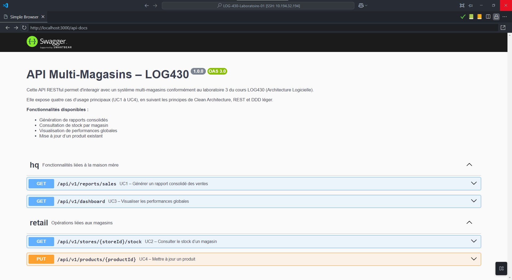

# LOG430 – Système de caisse multi-magasins (Labo 3)

Ce projet constitue la **suite évolutive** des laboratoires 0 à 3 du cours **LOG430 – Architecture Logicielle** (Été 2025).  
Il repose sur une architecture **Clean Architecture** avec **DDD léger**, une séparation stricte des couches, et expose depuis le **Labo 3** une **API RESTful** complète.

## Structure du projet

Le projet est divisé selon les principes de Clean Architecture :

```
src/
├── cli/            → Interface ligne de commande (laboratoires 1 et 2)
├── interfaces/api/ → Interface RESTful (ajoutée au laboratoire 3)
├── usecases/       → Cas d'utilisation métier
├── domain/         → Entités et interfaces de repository
├── infrastructure/ → Implémentations concrètes (BD, Sequelize, etc.)
```

---

## Cas d’utilisation exposés via API REST

| UC  | Méthode | URI                                | Description                                      |
|-----|---------|-------------------------------------|--------------------------------------------------|
| UC1 | `GET`   | `/api/v1/reports/sales`            | Génère un rapport consolidé des ventes          |
| UC2 | `GET`   | `/api/v1/stores/:storeId/stock`    | Consulte l'inventaire d’un magasin              |
| UC3 | `GET`   | `/api/v1/dashboard`                | Visualise les performances globales             |
| UC4 | `PUT`   | `/api/v1/products/:productId`      | Met à jour les informations d’un produit        |

---

## Documentation Swagger (OpenAPI)

L’API est entièrement documentée via Swagger :

- 🔗 Accessible depuis le conteneur Docker : [http://localhost:3000/api-docs](http://localhost:3000/api-docs)

### Exemple d'affichage Swagger :



### Démonstration vidéo

🎥 `docs/API/Demo-SwaggerUI.mp4` — Visualisation interactive des endpoints REST.

---

## 🧱 Décision d'Architecture

Le choix d’ajouter une API RESTful a été formalisé dans l’ADR suivant :

📄 [`docs/ADR/004-API-REST.md`](docs/ADR/004-API-REST.md)

> Cette ADR explique le contexte, les objectifs, et la structure adoptée pour l’interface REST.

---

## ✅ État de conformité (Labo 3)

| Exigence                                | Statut  |
|-----------------------------------------|---------|
| Architecture RESTful bien définie       | ✔️       |
| URI normalisés (ressources, pas de verbes) | ✔️    |
| Utilisation correcte des méthodes HTTP  | ✔️       |
| Couche API séparée des usecases         | ✔️       |
| Inversion de dépendance respectée       | ✔️       |
| Swagger complet et structuré            | ✔️       |
| Intégration CI/CD avec Docker           | ✔️       |
| ADR formalisée                          | ✔️       |

---

## 🚀 Lancer le projet

```bash
docker compose up --build
```

CLI : `npm run cli` 
Swagger : http://localhost:3000/api-docs 

---


---

## 🧪 Tests automatisés

Des tests automatisés (unitaires et d’intégration API) sont inclus avec le framework **Jest**.

### Lancer les tests dans l’environnement Docker :

```bash
npm run test
```

> Assurez-vous que les conteneurs sont démarrés et que les dépendances sont bien installées.

---

## ⚙️ Dépendances principales

- **Node.js** 20+
- **Express.js** – Serveur REST
- **Sequelize** – ORM pour PostgreSQL
- **Jest** – Framework de test
- **Docker / Docker Compose** – Conteneurisation
- **Swagger UI** – Documentation interactive
- **ESLint** – Standardisation du code

---

## Auteur

Projet réalisé par **Massy Haddad** dans le cadre du cours LOG430 – École de technologie supérieure (ÉTS), Été 2025.