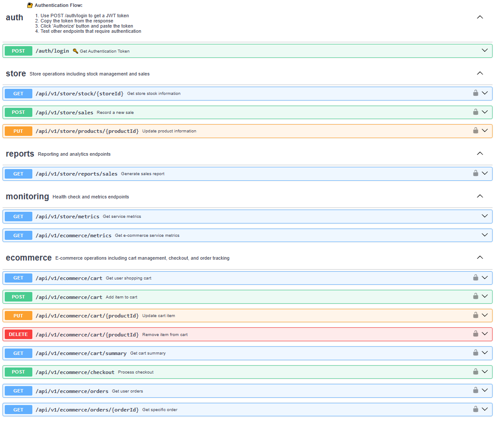
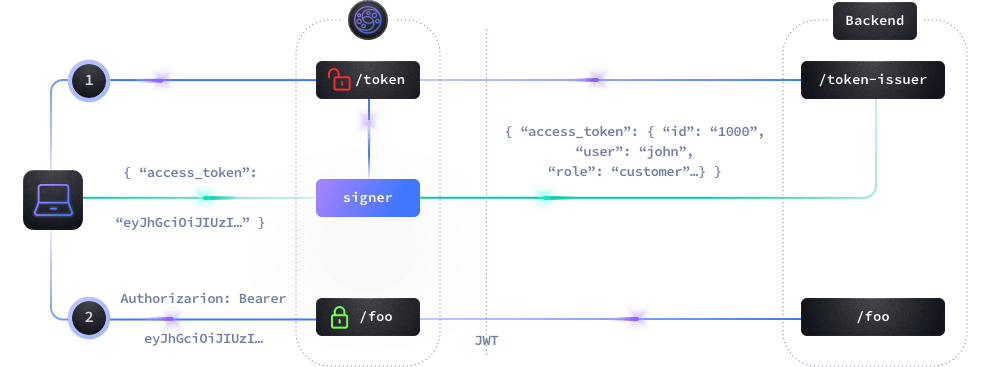
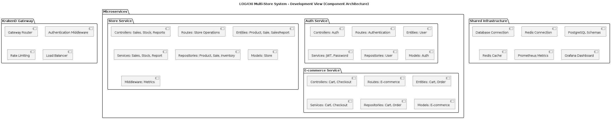
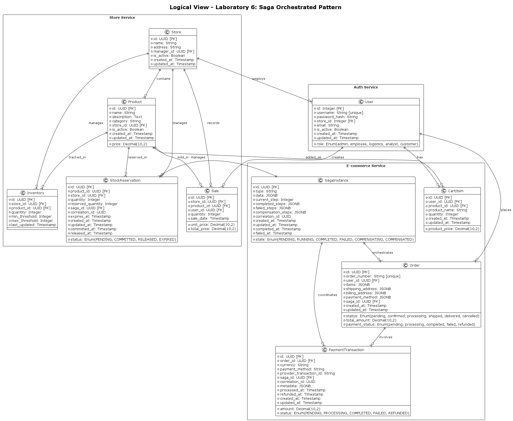
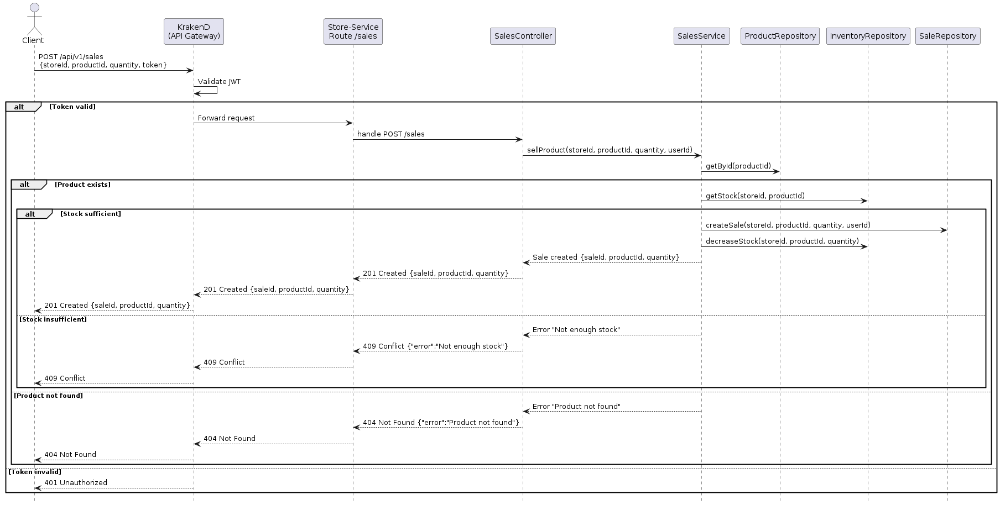
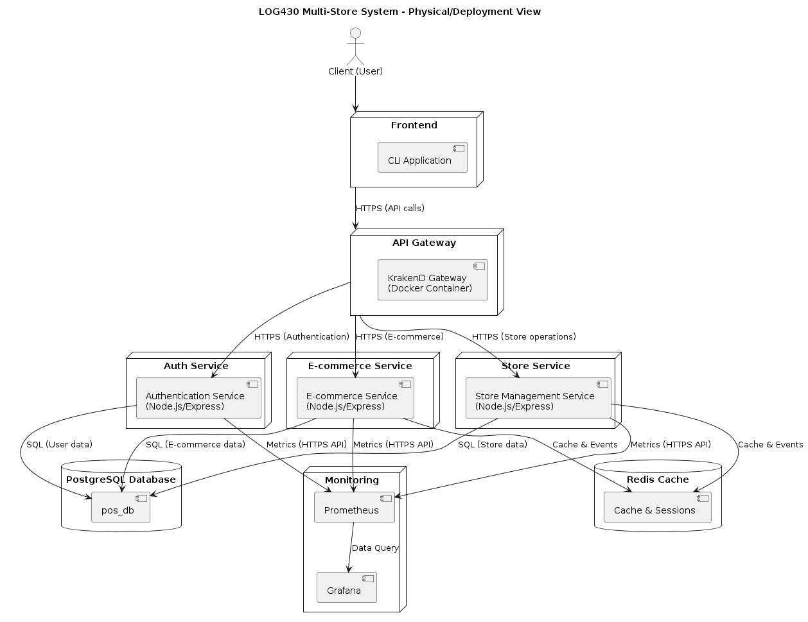

# Rapport ARC42 - Laboratoire 5
## Passage à une Architecture Microservices avec API Gateway et Observabilité

**Cours :** LOG430 – Architecture Logicielle  
**Session :** Été 2025  
**Auteur :** Massy Haddad  
**Date :** 8 août 2025  

---

## 1. Introduction et Objectifs

### 1.1 Description du Système

Le système de caisse multi-magasins a évolué d'une architecture monolithique vers une **architecture microservices** avec **API Gateway KrakenD** et **observabilité complète**. Le système supporte les opérations de stock, ventes, e-commerce et génération de rapports pour une chaîne de magasins.

**Architecture actuelle :** 3 microservices (Auth, Store, E-commerce) + API Gateway + Monitoring (Prometheus/Grafana).

### 1.2 Cas d'Utilisation Principaux

Le système expose les fonctionnalités suivantes via l'API Gateway :



### 1.3 Objectifs Qualité

#### Performance
- **P95 < 100ms** en conditions normales
- **Support de 200+ req/sec** (validé par test Black Friday : 278 req/sec)

#### Observabilité
- Métriques **Golden Signals** (Latence, Trafic, Erreurs, Saturation)
- Dashboards **Grafana** temps réel avec données **Prometheus**

#### Résilience
- Isolation des pannes entre microservices
- Authentification centralisée via **JWT**

### 1.4 Parties Prenantes

| Rôle | Attentes |
|------|----------|
| **Clients** | Expérience fluide, temps de réponse rapide |
| **Gérants Magasins** | Accès rapide au stock, interface réactive |
| **Employés Magasins** | Interface intuitive, accès rapide aux données |
| **Développeurs** | Architecture modulaire, documentation OpenAPI |
| **DevOps** | Monitoring complet, déploiement facile |

### 1.5 Scope du Laboratoire

**Inclus :**
- 3 microservices : `authentication`, `store` et `e-commerce`
- API Gateway KrakenD sur port `3000`
- Stack monitoring : Prometheus `:9090` + Grafana `:3002`
- Tests de charge Artillery.js (`artillery load-test.yaml`)
- Documentation Swagger intégrée (accessible via le port `3000/docs`)

**Exclusions :**
- Déploiement production (dev uniquement)
- Base de données distribuée (PostgreSQL partagée)
- Orchestration Kubernetes

---

## 2. Contraintes

### 2.1 Contraintes Techniques

| Contrainte | Justification |
|------------|---------------|
| **Docker/Docker Compose** | Environnement de développement standardisé, déploiement simplifié |
| **Node.js 20+** | Cohérence technologique, support des modules ES6 |
| **PostgreSQL partagée** | Simplicité pour le laboratoire, évite la complexité des BD distribuées |
| **REST/HTTP uniquement** | Standard industriel, simplicité d'implémentation |
| **Ports fixes** | KrakenD:3000, Prometheus:9090, Grafana:3002 pour configuration stable |

### 2.2 Contraintes Organisationnelles

- **Contexte pédagogique** : Focus sur l'architecture plutôt que la production
- **Ressources limitées** : Déploiement local uniquement
- **Durée du laboratoire** : Implémentation en quelques semaines

### 2.3 Contraintes de Sécurité

- **JWT HS256** : Algorithme symétrique pour simplifier la gestion des clés
- **Authentification centralisée** : Via API Gateway uniquement
- **CORS configuré** : Autorisation cross-origin pour développement



---

## 3. Contexte et Périmètre

### 3.1 Contexte Métier

Le système de caisse multi-magasins expose ses fonctionnalités via une **API Gateway unique** qui orchestre les interactions entre les différents acteurs et microservices.

#### Acteurs Externes et Interfaces

| Acteur | Interface | Description | Données Échangées |
|--------|-----------|-------------|-------------------|
| **Clients E-commerce** | HTTP REST via KrakenD:3000 | Navigation, commandes, panier | Produits, commandes, authentification |
| **Gérants Magasins** | HTTP REST via KrakenD:3000 | Consultation stock, ventes | Inventaire, rapports de vente |
| **Employés Siège** | HTTP REST via KrakenD:3000 | Gestion produits, rapports consolidés | Données produits, analytics |
| **Tests de Charge** | Artillery.js → KrakenD | Simulation trafic Black Friday | Requêtes d'authentification |
| **Équipe DevOps** | Grafana:3002, Prometheus:9090 | Monitoring, alertes | Métriques techniques |
| **Documentation** | Swagger UI via KrakenD:3000/docs | Documentation API interactive | Spécifications OpenAPI |

### 3.2 Contexte Technique

#### Interfaces Techniques Détaillées

| Interface | Protocole | Description | Configuration |
|-----------|-----------|-------------|---------------|
| **API Gateway** | HTTP/1.1, JSON | Point d'entrée REST unique | KrakenD, Rate limiting, JWT validation |
| **Microservices** | HTTP/1.1, JSON | Communication synchrone | Express.js, métriques Prometheus |
| **Base de données** | PostgreSQL | Persistance partagée | Port 5432, auth par env variables |
| **Cache** | Redis | Sessions et cache applicatif | Port 6379, TTL configurables |
| **Monitoring** | HTTP, Prometheus | Collecte métriques temps réel | Scraping 15s, rétention 15 jours |
| **Documentation** | HTTP | Swagger UI intégrée | OpenAPI 3.0, auto-générée |

#### Contraintes Réseau

- **Réseau Docker** : `pos-net` isolé pour sécurité
- **Communication interne** : Résolution DNS par nom de service
- **Exposition externe** : Ports mappés uniquement pour interfaces publiques
- **Sécurité** : JWT propagé via headers HTTP, CORS configuré

---

## 4. Stratégie de Solution

### Décisions Architecturales Fondamentales

| Objectif Qualité | Scénario | Approche Solution | Implémentation |
|------------------|----------|-------------------|----------------|
| **Performance** | Supporter 200+ req/sec (Black Friday) | Architecture microservices + API Gateway | KrakenD avec rate limiting, 3 services isolés |
| **Observabilité** | Monitoring temps réel des Golden Signals | Stack Prometheus/Grafana intégrée | Métriques automatiques, dashboards pré-configurés |
| **Résilience** | Isolation des pannes entre services | Séparation par domaines métier | Services auth, store, ecommerce indépendants |
| **Scalabilité** | Montée en charge horizontale | Load balancing via API Gateway | KrakenD multi-backend, health checks |
| **Maintenabilité** | Déploiement et développement simplifiés | Containerisation complète | Docker Compose, volumes dev, hot-reload |

### Technologies Clés

- **API Gateway** : KrakenD (performance, configuration JSON déclarative)
- **Microservices** : Node.js + Express (cohérence tech, rapidité développement)  
- **Observabilité** : Prometheus + Grafana (standard industrie, intégration native)
- **Orchestration** : Docker Compose (simplicité vs. Kubernetes pour le scope laboratoire)
- **Authentification** : JWT centralisé (sécurité, stateless)

---

## 5. Vue des Blocs de Construction

### 5.1 Architecture des Composants (Vue de développement)

Le système suit une architecture microservices avec séparation claire des responsabilités par domaine métier :

> Vue de développement (Diagrammes 4+1)


> Vue logique (Diagrammes 4+1)


### 5.2 Composants Principaux

| Composant | Responsabilité | Technologies | Ports |
|-----------|----------------|--------------|-------|
| **KrakenD Gateway** | Routage, authentification, rate limiting | KrakenD, JWT validation | 3000 |
| **Auth Service** | Gestion utilisateurs, JWT | Node.js, Express, bcrypt | 3001 |
| **Store Service** | Stock, ventes, rapports | Node.js, Express, metrics | 3000 |
| **E-commerce Service** | Panier, commandes | Node.js, Express, Redis | 3003 |
| **PostgreSQL** | Persistance données métier | PostgreSQL 15 | 5432 |
| **Redis** | Cache et sessions | Redis 7 | 6379 |
| **Monitoring Stack** | Métriques et dashboards | Prometheus + Grafana | 9090, 3002 |

### 5.3 Interfaces Entre Composants

- **API Gateway → Microservices** : HTTP REST, JWT forwarding
- **Microservices → Database** : PostgreSQL client, connection pooling  
- **Microservices → Cache** : Redis client, TTL-based caching
- **Monitoring → Services** : Prometheus scraping `/metrics` endpoints

Chaque microservice expose ses métriques et maintient son isolation via containerisation Docker.

---

## 6. Vue d'Exécution

### 6.1 Scénarios d'Exécution Principaux

Le système traite les requêtes via l'API Gateway avec validation JWT et routage vers les microservices appropriés :



### 6.2 Flux d'Exécution Type : Vente Produit

| Étape | Composant | Action | Résultat |
|-------|-----------|--------|----------|
| 1 | **Client** | `POST /api/v1/sales` + JWT | Demande de vente |
| 2 | **KrakenD** | Validation JWT + routage | Forward vers Store Service |
| 3 | **Store Controller** | Traitement requête | Appel SalesService |
| 4 | **SalesService** | Validation produit/stock | Vérifications métier |
| 5 | **Repositories** | Accès données (Product, Inventory, Sale) | Lecture/écriture PostgreSQL |
| 6 | **Réponse** | Retour statut 201/409/404 | Confirmation ou erreur |

### 6.3 Gestion des Erreurs

- **401 Unauthorized** : JWT invalide (Gateway)
- **404 Not Found** : Produit inexistant (Store Service)  
- **409 Conflict** : Stock insuffisant (Store Service)
- **Health Checks** : Surveillance continue via Docker (30s interval)

Le système garantit la cohérence des données via les transactions PostgreSQL et la validation à chaque niveau.

---

## 7. Vue de Déploiement

### 7.1 Architecture de Déploiement

L'architecture utilise Docker Compose pour orchestrer 10 conteneurs sur un réseau isolé `pos-net` :



**Load Balancing automatique** : Le diagramme simplifie la vue en montrant un seul conteneur par service, mais KrakenD gère automatiquement la répartition de charge via Docker Compose. 

**Exemple** : `docker-compose up --scale store=3` crée 3 instances du Store Service. KrakenD distribue automatiquement les requêtes entre `store_1`, `store_2`, `store_3` grâce à la résolution DNS Docker et sa configuration multi-backend.

### 7.2 Conteneurs et Ports

| Conteneur | Image | Port Exposé | Port Interne | Dépendances |
|-----------|-------|-------------|--------------|-------------|
| **krakend** | `krakend` | 3000 | 3000 | auth, store, ecommerce (health) |
| **auth** | `./auth` (build) | 3001 | 3000 | db |
| **store** | `./store` (build) | dynamique | 3000 | db, redis |
| **ecommerce** | `./e-commerce` (build) | 3003 | 3000 | db, redis |
| **pos_pg** | `postgres:15` | 5432 | 5432 | - |
| **redis** | `redis:7` | 6379 | 6379 | - |
| **prometheus** | `prom/prometheus` | 9090 | 9090 | - |
| **grafana** | `grafana/grafana` | 3002 | 3000 | prometheus |
| **swagger-ui** | `swaggerapi/swagger-ui` | 8080 | 8080 | krakend |
| **artillery** | `./load-test` (build) | - | - | tous services (profile) |

### 7.3 Configuration Réseau

- **Réseau isolé** : `pos-net` pour sécurité et communication inter-services
- **Health checks** : Surveillance automatique (30s interval, 3 retries)
- **Volumes persistants** : `pos_data` (PostgreSQL), `grafana-storage` (dashboards)
- **Variables d'environnement** : JWT secrets, credentials DB centralisés

Le déploiement garantit le démarrage ordonné via `depends_on` et health checks.

---

## 8. Concepts Transversaux

### 8.1 Sécurité et Authentification

**JWT centralisé** via API Gateway :
- **Validation** : KrakenD vérifie le JWT avec clé symétrique HS256
- **Propagation** : Headers `X-User-Id`, `X-User-Name`, `X-User-Role` vers microservices
- **Expiration** : 1h par défaut, configurable via `JWT_EXPIRES_IN`
- **Rate limiting** : 50 tentatives/15min pour auth, 30-100 req/min par endpoint
> Voir plus haut dans la section "Authentification flow"

### 8.2 Monitoring et Observabilité

**Métriques Prometheus** standardisées :
- **Golden Signals** : Latence, trafic, erreurs, saturation
- **Endpoints** : `/metrics` sur chaque microservice 
- **Collecte** : Scraping automatique 15s, rétention 15 jours
- **Business metrics** : Opérations panier, commandes, ventes

### 8.3 Gestion d'Erreurs

**Format uniforme** JSON avec codes d'erreur :
```json
{
  "success": false,
  "error": {
    "code": "VALIDATION_ERROR",
    "message": "Validation failed",
    "details": [...]
  }
}
```

**Codes standard** : 400 (validation), 401 (auth), 403 (autorisation), 404 (ressource), 409 (conflit), 429 (rate limit), 503 (indisponible).

### 8.4 Logging et Traçabilité

**Format JSON structuré** :
- **Timestamp** ISO 8601, méthode HTTP, path, statut, durée
- **Corrélation** via headers `X-User-Id` pour traçage cross-services
- **Login tracking** : Table `user_login_logs` avec IP, User-Agent, succès

Le système garantit la cohérence via ces patterns appliqués sur tous les microservices.

---

## 9. Décisions Architecturales

### 9.1 ADR-005 : Choix API Gateway KrakenD

**Problème** : Point d'entrée unique requis pour centraliser l'accès aux microservices, JWT et routage.

**Décision** : **KrakenD** choisi pour configuration déclarative JSON, performance et support natif JWT/rate limiting.

**Alternatives rejetées** : Express personnalisé (maintenance), Kong (complexité), NGINX (fonctionnalités limitées).

### 9.2 ADR-006 : Load Balancing Docker Compose

**Problème** : Scalabilité des services sous forte charge (ex: Black Friday 278 req/sec).

**Décision** : **Réplication services via Docker Compose** + load balancing automatique KrakenD multi-backend.

**Rationale** : Simplicité vs Kubernetes, scalabilité horizontale préservée, timeouts configurables.

**Impact** : Services peuvent être répliqués (`docker-compose up --scale store=2`), KrakenD distribue automatiquement.

Ces décisions privilégient la simplicité d'implémentation tout en préservant les objectifs de performance et scalabilité.

---

## 11. Risques et Dette Technique

### 11.1 Dette Technique Principale

**Base de données partagée** : Le système utilise une seule instance PostgreSQL (`pos_db`) partagée entre les 3 microservices, créant un **monolithe modulaire** plutôt qu'une véritable architecture microservices.

**Impact** :
- **Couplage de données** : Modifications schema affectent tous les services
- **Point de défaillance unique** : Panne DB = arrêt complet du système
- **Scalabilité limitée** : Impossible de scaler individuellement les données par service

### 11.2 Migration Recommandée

**Solution** : Séparer en bases de données dédiées par domaine :
```yaml
# Exemple docker-compose évolutif
auth_db: postgres:15 (schéma users, login_logs)
store_db: postgres:15 (schéma products, inventory, sales)  
ecommerce_db: postgres:15 (schéma carts, orders)
```

**Avantages** : Isolation complète, scalabilité indépendante, résilience améliorée.

**Effort estimé** : Faible - modification docker-compose + variables d'environnement, schémas déjà séparés par namespace.

Le choix actuel reste justifié pour le scope pédagogique du laboratoire.

---

## 12. Monitoring et Validation

### 12.1 Test de Charge Black Friday

**Simulation** : Test intensif avec **18 100 requêtes** sur 120 secondes, pic à **278 req/sec**.

**Scénarios testés** :
- 40.3% Cart Frenzy (7 302 users)
- 29.6% Speed Checkout (5 361 users)  
- 19.9% System Stress (3 606 users)
- 10.1% Cart Spam (1 831 users)

### 12.2 Résultats Performance

| Métrique | Valeur | Statut |
|----------|--------|--------|
| **Temps moyen** | 16.8 ms | Excellent |
| **P95** | 61 ms | Acceptable |
| **P99** | 102.5 ms | Limite |
| **Peak throughput** | 278 req/sec | Objectif atteint |
| **Stabilité** | 0 crash, 0 erreur 5xx | Système stable |

### 12.3 Dashboards Grafana Golden Signals

/Grafana-Dashboard-Laboratoire-5.jpg)

/Grafana-Dashboard-Dezoom-Laboratoire-5.jpg)

**Métriques surveillées** :
- **Latence** : P95 = 95ms (seuil vert < 100ms)
- **Trafic** : 0.0889 req/s en continu, pics à 278 req/sec
- **Erreurs** : 0% (100% HTTP 400 auth attendu)
- **Saturation** : ~300 connexions simultanées gérées

### 12.4 Conformité Objectifs

**Performance validée** : P95 < 100ms maintenu, 278 req/sec supportés

**Observabilité complète** : Golden Signals temps réel via Prometheus/Grafana

**Résilience confirmée** : Aucun crash sous forte charge, dégradation progressive

**Verdict** : Architecture conforme aux objectifs qualité et supporte les cas de charge critiques.

---

## 13. Glossaire

### 13.1 Termes Architecturaux

| Terme | Définition | Contexte Système |
|-------|------------|------------------|
| **API Gateway** | Point d'entrée unique centralisant l'accès aux microservices | KrakenD port 3000, JWT validation, rate limiting |
| **Microservice** | Service autonome responsable d'un domaine métier spécifique | Auth (3001), Store (3000), E-commerce (3003) |
| **Golden Signals** | 4 métriques clés : Latence, Trafic, Erreurs, Saturation | Prometheus/Grafana, monitoring temps réel |
| **Health Check** | Vérification automatique de l'état des services | HTTP `/health`, Docker 30s interval |
| **Load Balancing** | Répartition automatique de charge entre instances | KrakenD multi-backend, DNS Docker |
| **Circuit Breaker** | Protection contre les pannes en cascade | Implémenté via KrakenD timeouts |

### 13.2 Technologies et Composants

| Composant | Description | Port/Config | Documentation |
|-----------|-------------|-------------|---------------|
| **KrakenD** | API Gateway haute performance | Port 3000 | `krakend/krakend.json` |
| **Prometheus** | Collecteur de métriques temps réel | Port 9090 | `monitoring/prometheus.yml` |
| **Grafana** | Visualisation dashboards Golden Signals | Port 3002 | `monitoring/grafana/` |
| **PostgreSQL** | Base de données relationnelle partagée | Port 5432 | `pos_db` schema |
| **Redis** | Cache et sessions en mémoire | Port 6379 | TTL configurables |
| **Artillery** | Outil de test de charge | Profile load-test | `load-test/artillery.yml` |
| **Swagger UI** | Documentation API interactive | Port 8080 | `krakend/openapi.json` |

### 13.3 Concepts Métier

| Concept | Définition | Implémentation | Responsable |
|---------|------------|----------------|-------------|
| **JWT Token** | Jeton d'authentification JSON Web Token | HS256, expire 1h, centralisé | Auth Service |
| **Golden Signals** | Latence, Trafic, Erreurs, Saturation | P95 < 100ms, 278 req/sec validé | Prometheus |
| **Black Friday** | Simulation de trafic intense e-commerce | 18 100 requêtes, 4 scénarios | Artillery |
| **Health Check** | Surveillance continue des services | `/health` endpoints, 30s cycle | Docker Compose |
| **Rate Limiting** | Limitation du nombre de requêtes par IP | 50-100 req/min selon endpoint | KrakenD |
| **CORS** | Autorisation requêtes cross-origin | Headers configurés dev | Express middleware |

### 13.4 Architecture et Patterns

| Pattern/Concept | Application | Avantage | Limitations |
|-----------------|-------------|----------|-------------|
| **Monolithe Modulaire** | PostgreSQL partagée entre services | Simplicité déploiement | Couplage données, SPOF |
| **Domain-Driven Design** | Séparation Auth/Store/E-commerce | Isolation responsabilités | Base commune |
| **Container-First** | Docker Compose orchestration | Portabilité, isolation | Dev uniquement |
| **Configuration as Code** | `krakend.json`, `docker-compose.yml` | Versioning, reproductibilité | Complexité config |
| **Observability-First** | Métriques intégrées dès conception | Monitoring proactif | Overhead performance |
| **API-First** | OpenAPI 3.0, Swagger documentation | Contrat d'interface clair | Maintenance sync |